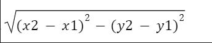

# DISTANCE-BETWEEN-TWO-POINTS

## AIM:
To write a python program to find the distance two 2 points
## ALGORITHM:
### Step 1: 
Using import math function,do the calculations.
### Step 2: 
Take the two coordinates as l1 and l2.
### Step 3: 
Substitute the values in the distance formula


### Step 4: 
using the print function, display the distance between the two points.
### Step 5: 
End the program.
### PROGRAM:
```
#Program to find the distance between two points.
#Developed by: Ranjan K
#RegisterNumber:212222230116
import math
l1=[4,2]
l2=[10,6]
d=math.sqrt(((l2[0]-l1[0])**2)+((l2[1]-l1[1])**2))
print("{:.2f}".format(d))
```
  
### OUTPUT:


### RESULT:
Thus the distance of the two points is sucessfully executed and displayed.
